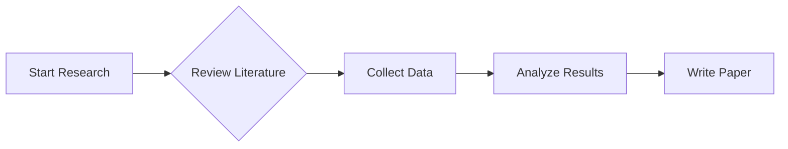

$x = \frac{-b \pm \sqrt{b^2 - 4 a c}}{2a}$

$$x = \frac{-b \pm \sqrt{b^2 - 4 a c}}{2a}$$

```mermaid
graph LR
    A[Start Research] --> B{Review Literature}
    B --> C[Collect Data]
    C --> D[Analyze Results]
    D --> E[Write Paper]
```
